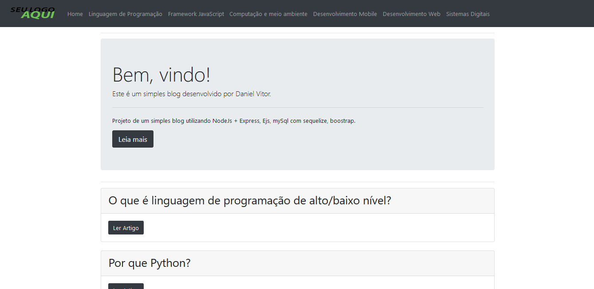

# GuiaPress
> Aplicação para gerencimento de um blog com painel administativo.

Um blog onde é possível criar artigos e definir categorias para tais artigos.

## Exemplo de uso

Você sendo um admin, terá acesso a criação de categorias e artigos.
Já um usuário, pode ler os artigos, que estão separados por categorias.

## Feramentas utilizadas

* NodeJS + Express
* EJS
* Bootstrap
* MySql
* Sequelize
* TinyMCE
* BcryptJS
* Nodemon
* Slugify
